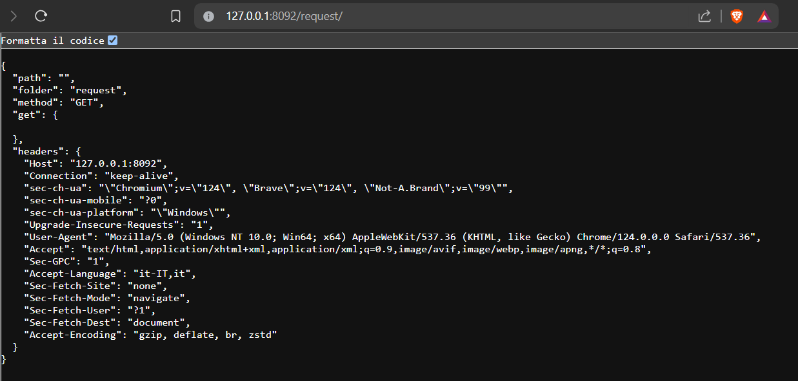
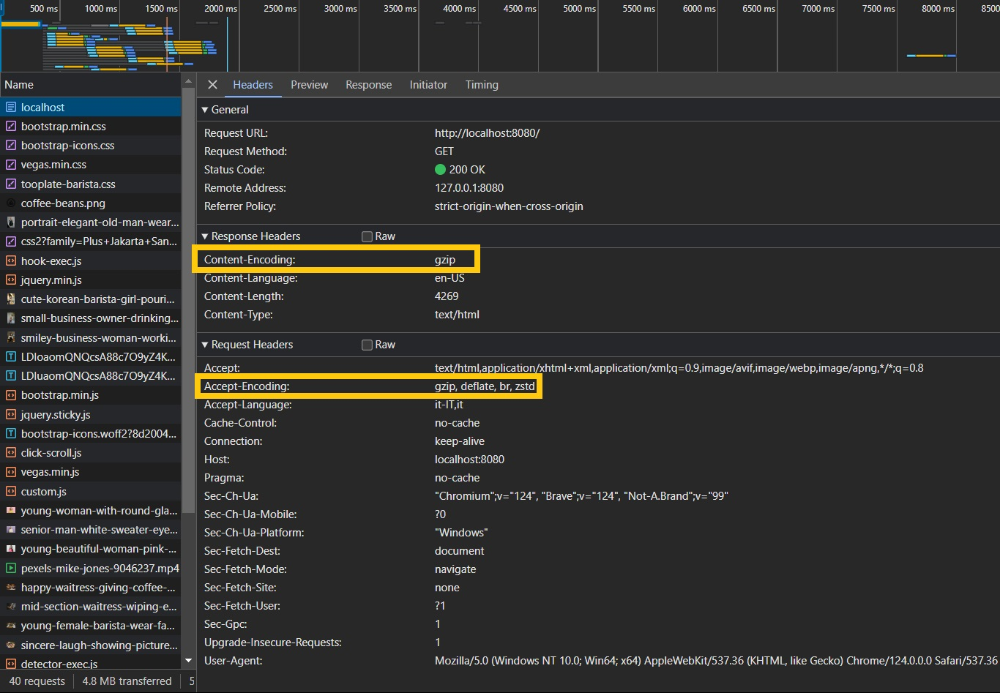

# <center>Ryno Simple Web Server in Python</center>
### <center>Relazione sul Progetto di Web Server Semplice</center>
### <center>Autore: Mattia Senni</center>
\
\
\
\
\
\
\
\
\
\
&#8203;

# Indice

- [Parte 1: Introduzione e Obbiettivi](#parte-1-introduzione-e-obbiettivi)
  * [Parte 1.1: Introduzione](#parte-11-introduzione)
  * [Parte 1.2: Obiettivi del Progetto](#parte-12-obbiettivi-del-progetto)
  * [Parte 1.3: Implementazione del Web Server](#parte-13-implementazione-del-web-server)
- [Parte 2: Progettazione e Implementazione](#parte-2-progettazione-e-implementazione)
    * [2.1 Struttura del Codice](#21-struttura-del-codice)
    * [2.2 Gestione delle Richieste](#22-gestione-delle-richieste)
    * [2.3 Middleware](#23-middleware)
    * [2.4 Gestione degli Errori](#24-gestione-degli-errori)
    * [2.5 Configurazione del Server](#25-configurazione-del-server)
    * [2.6 Servizio dei File Statici](#26-servizio-dei-file-statici)
    * [2.7 Gestione della Concorrenza](#27-gestione-della-concorrenza)
- [Parte 3: Utilizzo del Web Server](#parte-3-utilizzo-del-web-server)
    * [3.1 Utilizzo del Web Server](#31-utilizzo-del-web-server)
    * [3.2 Avvio del web server (bash)](#32-avvio-del-web-server-bash)
- [Parte 4: Esempio di Utilizzo del Web Server](#parte-4-esempio-di-utilizzo-del-web-server)
    * [4.1 Introduzione](#41-introduzione)
    * [4.2 Accesso al Sito Web Statico](#42-accesso-al-sito-web-statico)
    * [4.3 Accesso all'API per le Richieste](#43-accesso-a-api-per-le-richieste)
    * [4.4 Supporto per la Compressione Gzip](#44-supporto-per-la-compressione-gzip)
- [Parte 5: Conclusioni e possibili migliore](#parte-5-conclusioni-e-possibili-migliore)
    * [5.1 Commento finale e Possibili Migliorie](#51-commento-finale-e-possibili-migliorie)
    * [5.2 Conclusioni](#52-conclusioni)

# Parte 1: Introduzione e Obbiettivi

## Parte 1.1: Introduzione

Il presente documento illustra il progetto di sviluppo di un web server semplice in linguaggio Python. Il web server ha l'obiettivo di servire file statici e gestire richieste HTTP GET di base.

## Parte 1.2: Obiettivi del Progetto

L'obiettivo principale del progetto era implementare un web server funzionante in Python che potesse gestire le seguenti funzionalità:

- Servire file statici come HTML, CSS, e immagini.
- Gestire richieste HTTP GET di base.
- Gestire più richieste simultaneamente in modo concorrente o tramite thread.
- Assicurare la corretta gestione degli header HTTP e dei codici di stato nelle risposte del server.

## Parte 1.3: Implementazione del Web Server

Il web server è stato implementato utilizzando il linguaggio Python e sfruttando le librerie standard per la gestione delle connessioni socket e delle richieste HTTP. Di seguito sono descritte brevemente le principali funzionalità implementate:

- **Gestione delle Richieste**: Il server è in grado di gestire richieste HTTP GET di base, analizzando il metodo, il percorso richiesto e gli eventuali parametri GET inclusi nell'URL.
- **Servizio dei File Statici**: È stato implementato un meccanismo per servire file statici come HTML, CSS, e immagini, garantendo una corretta risposta alle richieste dei client.
- **Concorrenza**: Il server è in grado di gestire più richieste simultaneamente tramite un approccio concorrente che utilizza un thread per ogni nuova connessione in entrata.
- **Gestione degli Header HTTP e dei Codici di Stato**: Ogni risposta del server include gli header HTTP appropriati e i relativi codici di stato per indicare lo stato della richiesta.

# Parte 2: Progettazione e Implementazione

## 2.1 Struttura del Codice

Il codice del web server è stato organizzato in modo modulare per favorire la manutenibilità e la facilità di estensione. La struttura principale del codice include:

- **server.py**: Il punto di ingresso del server, che avvia il server e gestisce le connessioni in arrivo.
- **main.py**: Il modulo responsabile della gestione delle richieste e dell'aggiunta dei middleware.
- **kernel**: Una directory contenente i moduli fondamentali del server, tra cui `handle_request.py`, `middleware.py`, `response.py`, e altri file di configurazione.

## 2.2 Gestione delle Richieste

Il modulo `handle_request.py` si occupa della gestione delle richieste HTTP in arrivo. Una volta ricevuta una richiesta, il server analizza il metodo, il percorso richiesto, gli eventuali parametri GET inclusi nell'URL e gli header presenti nel corpo della richiesta. Successivamente, la richiesta viene instradata attraverso i middleware per l'elaborazione.

## 2.3 Middleware

Il modulo `middleware.py` gestisce l'aggiunta e l'esecuzione dei middleware. I middleware consentono di eseguire operazioni predefinite sulle richieste e sulle risposte in maniera lineare e gerarchica utilizzando anche un sistema routing. Alcuni esempi sono l'aggiunta di header HTTP e la compressione dei contenuti. Questo approccio consente una maggiore flessibilità e modularità nell'implementazione delle funzionalità del server.

## 2.4 Gestione degli Errori

Il modulo `errors.py` contiene le funzioni per la gestione degli errori del server. Attualmente, sono implementate le funzioni per la gestione degli errori 404 (Not Found) e 500 (Internal Server Error), che vengono restituiti al client in caso di risorsa non trovata o errore interno del server.

## 2.5 Configurazione del Server

Il modulo `conf.py` contiene la configurazione del server, inclusi parametri come l'indirizzo IP e la porta su cui il server è in ascolto, nonché la dimensione massima del buffer per le richieste in entrata.

## 2.6 Servizio dei File Statici

Una delle funzionalità principali del web server è il servizio dei file statici. Utilizzando il middleware `server_static`, il server è in grado di servire file come HTML, CSS, e immagini in risposta alle richieste dei client. Il server verifica l'esistenza del file richiesto e, se presente, lo trasmette al client insieme agli header HTTP appropriati che ne descrivano al meglio il contenuto.

## 2.7 Gestione della Concorrenza

Per garantire una maggiore efficienza e scalabilità, il server è in grado di gestire più richieste simultaneamente. Questo viene realizzato utilizzando il concetto di thread, dove ogni connessione in arrivo viene gestita da un thread separato. Ciò consente al server di continuare a servire le richieste degli altri client mentre gestisce una richiesta in corso.

# Parte 3: Utilizzo del Web Server

## 3.1 Utilizzo del Web Server

Il web server può essere utilizzato per ospitare siti web statici e gestire richieste HTTP di base. Per avviare il server, è sufficiente eseguire il file server.py tramite Python.
Per una corretta esecuzione del server è necessario avere un versione di Python superiore alla 3, Il server è stato sviluppato e testato con Python v. 3.10.12, è quindi garantita la corretta esecuzione del server con questa versione di Python.
Una volta avviato, il server sarà in ascolto su una determinata porta (configurabile nel file conf.py) e sarà in grado di servire file statici e gestire richieste HTTP GET.

## 3.2 Avvio del web server (bash)
```bash
# assicurarsi di essere all'interno del progetto Ryno Simple web Server in Python
# assicurarsi di avere una versione di python supportata (vedi punto 3.1)
python --version 
# mettere in esecuzione il server (una volta partito il server comunicherà su che porta gira), è possibile configurare la porta da /src/kernel/conf.py
python server.py 
```

# Parte 4: Esempio di Utilizzo del Web Server

## 4.1 Introduzione

Per comprendere meglio il funzionamento del web server e le sue capacità, verrà fornito un esempio pratico di utilizzo. Il web server è in grado di servire sia pagine HTML e risorse statiche come file CSS, JavaScript, immagini JPEG, video MP4 e font, sia risposte API con formato JSON tramite richieste GET.
\
Di default il server parte sulla porta 8080.

## 4.2 Accesso al Sito Web Statico

Dopo aver avviato il web server e collegandosi tramite un browser all'indirizzo del server, sarà possibile accedere al sito web statico. Navigando nella cartella radice `/`, si potrà visualizzare un sito web statico con le pagine HTML, i file CSS, i file JavaScript, le immagini JPEG, i video MP4 e i font.
\
\
Esempio di visualizzazione del sito web servito dal web server (Assumendo che il server sia stato eseguito dalla stessa macchina che lo testa, e che nel file conf.py la porta sia la 8080).
```
http://host_address:port/ #host_address è l'indirizzo del computer che mette in esecuzione il server, port è la porta indicata su conf.py
http://localhost:8080/ #esempio con localhost e porta 8080
```
\


## 4.3 Accesso a API per le Richieste

Inoltre, è disponibile un endpoint API per visualizzare un esempio di risposta API con gestione degli header per il contenuto in formato JSON. Accedendo alla route `/request/`, sarà possibile visualizzare la risposta API che mostra i parametri della richiesta estratti dal pacchetto della richiesta HTTP.
\
\
Esempio di visualizzazione del sito web servito dal web server (Assumendo che il server sia stato eseguito dalla stessa macchina che lo testa, e che nel file conf.py la porta sia la 8080).
```
http://host_address:port/request/ #host_address è l'indirizzo del computer che mette in esecuzione il server, port è la porta indicata su conf.py
http://localhost:8080/request/ #esempio con localhost e porta 8080
```
\



## 4.4 Supporto per la Compressione Gzip

Entrambe le route, sia per il sito web statico che per l'API delle richieste, supportano la compressione Gzip se nella richiesta HTTP è presente l'header `Accept-Encoding` che indica il supporto per la compressione.
\
\
Come si può vedere dall'esempio sottostante il browser invia l'header `Accept-Encoding: gzip` e il server risponde con l'header `Content-Encoding: gzip` indicando che il contenuto è stato compresso con Gzip.
\


# Parte 5: Conclusioni e possibili migliore

## 5.1 Commento finale e Possibili Migliorie

Nonostante il web server soddisfi attualmente i requisiti specificati nell'assegnazione, ci sono alcune aree in cui potrebbe essere migliorato e ampliato:

- **Supporto per altri metodi HTTP**: Attualmente, il server gestisce correttamente solamente richieste HTTP GET. Potrebbe essere esteso per supportare altri metodi HTTP come POST, PUT e DELETE (anche se tuttora è in grado di identificare con quale metodo viene eseguita la richiesta).
- **Sicurezza**: Potrebbero essere implementate misure di sicurezza aggiuntive per proteggere il server da attacchi comuni come attacchi DDoS e injection di codice.
- **Logging e Monitoraggio**: Potrebbe essere aggiunta la funzionalità di logging per tenere traccia delle richieste in arrivo e delle attività del server. Inoltre, potrebbe essere implementato un sistema di monitoraggio per monitorare le prestazioni del server e identificare eventuali problemi o anomalie.

## 5.2 Conclusioni

Il progetto di sviluppo del web server è stata molto utile per testare e comprendere i concetti fondamentali della programmazione di reti e dei servizi web. Attraverso l'implementazione di un web server semplice in Python, è stato possibile testare le competenze pratiche nella gestione delle connessioni socket, delle richieste HTTP e della concorrenza.